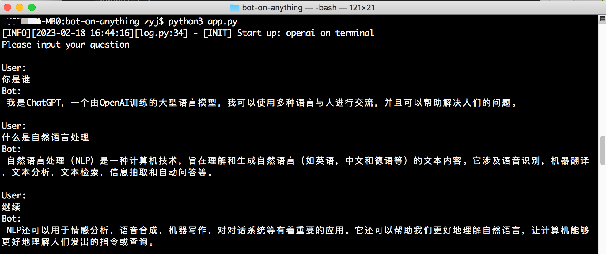
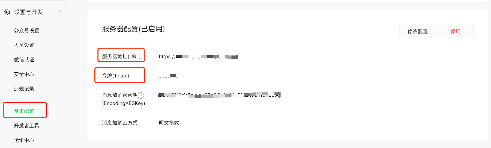

<p align="center"></p>

<p align="center">
   <a href="https://github.com/zhayujie/bot-on-anything/releases/latest"></a>
  <a href="https://github.com/zhayujie/bot-on-anything/blob/master/LICENSE"></a>
  <a href="https://github.com/zhayujie/bot-on-anything"></a> <br/>
    [<a href="/README.md">English</a>] | [中文]
</p>

**Bot on Anything** 是一个轻量的 AI 对话机器人框架，通过简单配置即可把各种大模型接入到不同的应用渠道，尤其适合 Telegram、Slack、Discord、Gmail 等海外渠道的快速搭建。

> 如果需要任务规划、长期记忆、技能、MCP、自进化 等更完整的 Agent Harness 能力，推荐使用 **[CowAgent](https://github.com/zhayujie/CowAgent)**，详见 [相关项目](#相关项目)。

<br/>

## 简介

只需一份简单的配置，就能在多种大模型和应用渠道之间选择一条连线，把一个对话机器人跑起来，并在同一个项目里随时切换不同的链路。模型和渠道相互独立：新增一个渠道可以直接复用已有的模型，新增一个模型也能在所有渠道上运行。

<br/>

## 🌟 核心能力

| 能力 | 说明 |
| :--- | :--- |
| 多模型 | 支持 OpenAI（GPT-5.5 / GPT-4.1 等）、LinkAI（一个 Key 接入 DeepSeek、Claude、Gemini 等 100+ 模型）、文心一言、New Bing、Bard，改一下配置里的 `type` 就能切换 |
| 多渠道 | 支持终端、Web、微信订阅号 / 服务号、企业微信、QQ、Telegram、Gmail、Slack、钉钉、飞书、Discord 等 12 个渠道 |
| 模型与渠道解耦 | 模型和渠道互不绑定，任意模型都能跑在任意渠道上，加一方就能复用另一方 |
| 多渠道并行 | 在一份配置里写多个渠道，即可用多进程同时启动，互不影响 |
| 插件扩展 | 兼容 [chatgpt-on-wechat](https://github.com/zhayujie/CowAgent/tree/master/plugins) 的插件机制，可扩展图片生成、模型选择等逻辑 |
| 轻量部署 | 纯 Python 实现，几行配置即可启动 |

<br/>

## 🚀 快速开始

### 1. 运行环境

支持 Linux、MacOS、Windows，需要先装好 Python，建议版本在 3.7.1~3.10 之间。

克隆代码并安装依赖：

```bash
git clone https://github.com/zhayujie/bot-on-anything
cd bot-on-anything/
pip3 install -r requirements.txt
```

### 2. 配置说明

核心配置文件是 `config.json`，项目里带了一份模板 `config-template.json`，复制一份就能得到实际生效的配置：

```bash
cp config-template.json config.json
```

每个模型和渠道都有各自的配置块，拼在一起就是完整的配置文件，整体结构如下：

```bash
{
  "model": {
    "type" : "openai",             # 选用的AI模型
    "openai": {
      # openAI配置
    }
  },
  "channel": {
    "type": "slack",            # 需要接入的渠道
    "slack": {
        # slack配置
    },
    "telegram": {
        # telegram配置
    }
  }
}
```

配置最外层分成 `model` 和 `channel` 两部分：`model` 是模型配置，`type` 指定用哪个模型；`channel` 是渠道配置，`type` 指定接入哪个渠道（也可以写成数组，同时启动多个渠道）。

平时只要改这两个 `type` 字段，就能在不同的模型和渠道之间切换。下面分别介绍每个模型和渠道的配置与运行方式（点击展开）。

### 3. 运行

在项目根目录下运行以下指令，默认渠道为终端：

```bash
python3 app.py
```

<br/>

## 🤖 选择模型

| 模型 | 说明 |
| :--- | :--- |
| [OpenAI](#openai) | 走 OpenAI 兼容对话接口，支持 GPT-5.5 / GPT-4.1 等模型，也可通过 `api_base` 接兼容网关 |
| [LinkAI](#linkai) | 一个 Key 接入 DeepSeek、Claude、Gemini、Qwen、GLM 等 100+ 模型 |
| [文心一言](#文心一言) | 基于百度文心一言网页版接入 |
| [New Bing](#new-bing) | 基于必应对话接入，可开启越狱模式 |
| [Bard](#bard) | 基于谷歌 Bard 网页版接入 |

> 提示：DeepSeek、Claude、Gemini 等其他厂商的模型，直接用 **LinkAI** 一个 Key 全搞定，也可以用 [CowAgent](https://github.com/zhayujie/CowAgent)。

<a id="openai"></a>
<details>
<summary><b>OpenAI</b></summary>

走 OpenAI 兼容的对话接口。`model` 填你的接口支持的模型名即可（如 `gpt-5.5`、`gpt-4.1`），也可以把 `api_base` 指向兼容网关来接入其他厂商。详情参考 [官方文档](https://platform.openai.com/docs/guides/chat)。

**安装依赖**

```bash
pip3 install "openai<1.0.0"
```
> 注：本项目用的是旧版 `openai` SDK（`0.27.x` 及以上、`1.0.0` 以下），`requirements.txt` 里已经锁定了兼容版本。如果安装失败可先升级 pip：`pip3 install --upgrade pip`。

**配置项说明**

```bash
{
  "model": {
    "type" : "chatgpt",
    "openai": {
      "api_key": "YOUR API KEY",
      "api_base": "",                                   # 选填，OpenAI 兼容接口地址
      "model": "gpt-5.5",                               # 模型名称
      "proxy": "http://127.0.0.1:7890",                 # 代理地址
      "character_desc": "你是ChatGPT, 一个由OpenAI训练的大型语言模型...",
      "conversation_max_tokens": 1000,                  # 回复最大的字符数，为输入和输出的总数
      "temperature":0.75,     # 熵值，在[0,1]之间，越大表示选取的候选词越随机
      "top_p":0.7,            # 候选词列表，0.7 意味着只考虑前70%候选词的标记
      "frequency_penalty":0.0,            # [-2,2]之间，该值越大则越降低模型一行中的重复用词
      "presence_penalty":1.0,             # [-2,2]之间，该值越大则越不受输入限制
    }
}
```
+ `api_key`：填注册账号时创建的 `OpenAI API KEY`
+ `api_base`（选填）：OpenAI 兼容接口地址，留空则走官方 API，也可指向兼容网关来接入其他厂商
+ `model`：接口支持的模型名，如 `gpt-5.5`、`gpt-4.1`、`gpt-4o`（GPT-5 系列只接受默认采样参数，本项目已自动处理）
+ `proxy`：代理客户端地址，详情参考 [#56](https://github.com/zhayujie/bot-on-anything/issues/56)
+ `character_desc`：机器人的人设，模型会按这段话来扮演角色，可以自由定制
+ `max_history_num`（可选）：对话记忆的最大长度，超过后会清理更早的记忆

</details>

<a id="linkai"></a>
<details>
<summary><b>LinkAI</b></summary>

**配置项说明**

```bash
{
  "model": {
    "type" : "linkai",
    "linkai": {
      "api_key": "",
      "api_base": "https://api.link-ai.tech",
      "app_code":  "",
      "model": "",
      "conversation_max_tokens": 1000,
      "temperature":0.75,
      "top_p":0.7,
      "frequency_penalty":0.0,
      "presence_penalty":1.0,
      "character_desc": "你是一位智能助手。"
    },
}
```

+ `api_key`：LinkAI 服务调用的密钥，可在 [控制台](https://link-ai.tech/console/interface) 创建
+ `app_code`：LinkAI 应用或工作流的 code，选填，参考 [应用创建](https://docs.link-ai.tech/platform/create-app)
+ `model`：一个 Key 即可接入 100+ 模型（DeepSeek、Claude、Gemini、Qwen、GLM、GPT 等），参考 [模型列表](https://docs.link-ai.tech/platform/api/chat#models)，也可以留空，在 [LinkAI 平台](https://link-ai.tech/console/factory) 修改应用的默认模型
+ 其他参数含义与 OpenAI 模型一致

</details>

<a id="文心一言"></a>
<details>
<summary><b>文心一言</b></summary>

基于百度文心一言网页版接入，需要手动获取 Cookie。

```bash
{
  "model": {
    "type" : "baidu",
    "baidu": {
      "acs_token": "YOUR ACS TOKEN",
      "cookie": "YOUR COOKIE"
    }
  }
}
```

+ `cookie`：登录 [文心一言](https://yiyan.baidu.com/) 网页版后，从浏览器开发者工具里获取
+ `acs_token`：同上，从请求参数里获取，具体做法可自行搜索相关教程

</details>

<a id="new-bing"></a>
<details>
<summary><b>New Bing</b></summary>

基于必应对话接入，依赖 `EdgeGPT` 库，需要登录 Bing 后获取 Cookie。

```bash
{
  "model": {
    "type" : "bing",
    "bing":{
      "jailbreak": true,
      "jailbreak_prompt": "...",
      "cookies": []
    }
  }
}
```

+ `cookies`：登录 [Bing](https://www.bing.com/) 后从浏览器导出的 Cookie 数组
+ `jailbreak`：是否开启越狱模式（Sydney 模式），开启后能绕过部分官方限制

</details>

<a id="bard"></a>
<details>
<summary><b>Bard</b></summary>

基于谷歌 Bard 网页版接入，需要登录后获取 Cookie。

```bash
{
  "model": {
    "type" : "bard",
    "bard": {
      "cookie": "YOUR COOKIE"
    }
  }
}
```

</details>

<br/>

## 💬 选择渠道

| 渠道 | 说明 |
| :--- | :--- |
| [命令行终端](#命令行终端) | 默认渠道，不用额外配置 |
| [Web](#web) | 网页端对话，基于 flask + socketio |
| [个人订阅号](#个人订阅号) | 微信个人订阅号自动回复 |
| [企业服务号](#企业服务号) | 微信认证服务号，可绕过 5 秒超时限制 |
| [QQ](#qq) | 依赖 go-cqhttp，支持私聊和群聊 |
| [Telegram](#telegram) | Telegram 机器人 |
| [Gmail](#gmail) | 通过邮件对话 |
| [Slack](#slack) | Slack 机器人，Socket Mode 不需要公网 IP |
| [钉钉](#钉钉) | 钉钉企业内部机器人 |
| [飞书](#飞书) | 飞书企业自建应用 |
| [企业微信](#企业微信) | 企业微信自建应用 |
| [Discord](#discord) | Discord 机器人 |

<a id="命令行终端"></a>
<details>
<summary><b>命令行终端</b></summary>

配置模板里默认启动的就是终端，不用额外配置，在项目目录下执行 `python3 app.py` 即可启动。直接在命令行输入就能和模型对话，支持流式输出。



</details>

<a id="web"></a>
<details>
<summary><b>Web</b></summary>

**Contributor:** [RegimenArsenic](https://github.com/RegimenArsenic)

**依赖**

```bash
pip3 install PyJWT flask flask_socketio
```

**配置**

```bash
"channel": {
    "type": "http",
    "http": {
      "http_auth_secret_key": "6d25a684-9558-11e9-aa94-efccd7a0659b",    // jwt认证秘钥
      "http_auth_password": "6.67428e-11",        // 认证密码，仅仅只是自用，最初步的防御别人扫描端口后DDOS浪费tokens
      "port": "80"       // 端口
    }
  }
```

本地运行：`python3 app.py` 运行后访问 `http://127.0.0.1:80`

服务器运行：部署后访问 `http://公网域名或IP:端口`

</details>

<a id="个人订阅号"></a>
<details>
<summary><b>个人订阅号</b></summary>

**需要：** 一台服务器，一个订阅号

**1. 依赖安装**

安装 [werobot](https://github.com/offu/WeRoBot) 依赖：

```bash
pip3 install werobot
```

**2. 配置**

```bash
"channel": {
    "type": "wechat_mp",
    "wechat_mp": {
      "token": "YOUR TOKEN",           # token值
      "port": "8088"                   # 程序启动监听的端口
    }
}
```

**3. 运行程序**

在项目目录下运行 `python3 app.py`，终端显示如下则表示已成功运行：

```
[INFO][2023-02-16 01:39:53][app.py:12] - [INIT] load config: ...
[INFO][2023-02-16 01:39:53][wechat_mp_channel.py:25] - [WX_Public] Wechat Public account service start!
Bottle v0.12.23 server starting up (using AutoServer())...
Listening on http://127.0.0.1:8088/
Hit Ctrl-C to quit.
```

**4. 设置公众号回调地址**

在 [微信公众平台](https://mp.weixin.qq.com/) 中进入个人订阅号，启用服务器配置：



**服务器地址（URL）**：如果在浏览器里通过这个 URL 能访问到服务器上的程序（默认监听 8088 端口），就说明配置生效了。公众号只能填 80/443 端口，可以把程序改成直接监听 80 端口（需要 sudo 权限），或者用 nginx 之类做反向代理转发。这里填公网 IP 或域名都行。

**令牌（Token）**：要和 `config.json` 里的 token 保持一致。

详细流程参考 [官方文档](https://developers.weixin.qq.com/doc/offiaccount/Getting_Started/Getting_Started_Guide.html)。

> 注：用户发消息后微信后台会往配置的 URL 推送，如果 5 秒内没回复就会断开连接并重试 3 次，而模型接口往往不止 5 秒。本项目用异步加缓存把这个限制放宽到了 15 秒，但再超时还是没法正常回复。对时效要求高的场景建议用「企业服务号」。

</details>

<a id="企业服务号"></a>
<details>
<summary><b>企业服务号</b></summary>

**需要：** 一个服务器、一个已微信认证的服务号

服务号的做法是先异步请求模型接口，拿到结果后再用客服接口主动推给用户，这样就绕过了订阅号 15 秒超时的问题。开发者模式的配置和订阅号类似，详情参考 [官方文档](https://developers.weixin.qq.com/doc/offiaccount/Getting_Started/Getting_Started_Guide.html)。

配置上只需把 `type` 改成 `wechat_mp_service`，配置块仍然复用 `wechat_mp`，再补上 `app_id` 和 `app_secret` 两项：

```bash
"channel": {
    "type": "wechat_mp_service",
    "wechat_mp": {
      "token": "YOUR TOKEN",            # token值
      "port": "8088",                   # 程序启动监听的端口
      "app_id": "YOUR APP ID",          # app ID
      "app_secret": "YOUR APP SECRET"   # app secret
    }
}
```

> 注意：要把服务器 IP 加到「IP 白名单」里，否则用户收不到主动推送的消息。

</details>

<a id="qq"></a>
<details>
<summary><b>QQ</b></summary>

**需要：** 一台 PC 或服务器（国内网络）、一个 QQ 号

跑 QQ 机器人还需要额外运行一个 `go-cqhttp`，它负责收发 QQ 消息，本项目则负责请求模型生成回复。

**1. 下载 go-cqhttp**

在 [go-cqhttp 的 Release](https://github.com/Mrs4s/go-cqhttp/releases) 里下载对应系统的版本，解压后把 `go-cqhttp` 二进制文件放到 `bot-on-anything/channel/qq` 目录下。该目录下已经有一份 `config.yml`，只需填上 QQ 账号（account-uin）即可。

**2. 安装 aiocqhttp**

使用 [aiocqhttp](https://github.com/nonebot/aiocqhttp) 来与 go-cqhttp 交互：

```bash
pip3 install aiocqhttp
```

**3. 配置**

把 `config.json` 里 channel 块的 `type` 改成 `qq` 即可：

```bash
"channel": {
    "type": "qq"
}
```

**4. 运行**

终端 1，进入项目根目录运行（监听 8080 端口）：

```bash
python3 app.py
```

终端 2，进入 `go-cqhttp` 所在目录运行：

```bash
cd channel/qq
./go-cqhttp
```

> 注：目前没有做关键词匹配和群聊白名单，所有私聊都会自动回复，群聊里被 @ 也会回复。如果遇到账号冻结之类的异常，可以把 `device.json` 里的 `protocol` 从 5 改成 2，参考这个 [Issue](https://github.com/Mrs4s/go-cqhttp/issues/1942)。

</details>

<a id="telegram"></a>
<details>
<summary><b>Telegram</b></summary>

Contributor: [brucelt1993](https://github.com/brucelt1993)

**1. 获取 token**

Telegram 机器人的申请可以自行搜索教程，关键是拿到机器人的 token id。

**2. 依赖安装**

```bash
pip install pyTelegramBotAPI
```

**3. 配置**

```bash
"channel": {
    "type": "telegram",
    "telegram":{
      "bot_token": "YOUR BOT TOKEN ID"
    }
}
```

</details>

<a id="gmail"></a>
<details>
<summary><b>Gmail</b></summary>

**需要：** 一个服务器、一个 Gmail 账号

**Contributor:** [Simon](https://github.com/413675377)

参考 [官方文档](https://support.google.com/mail/answer/185833?hl=en) 给 Google 账号创建一个 APP 密码，然后按下面配置即可：

```bash
"channel": {
    "type": "gmail",
    "gmail": {
      "subject_keyword": ["bot", "@bot"],
      "host_email": "xxxx@gmail.com",
      "host_password": "GMAIL ACCESS KEY"
    }
  }
```

</details>

<a id="slack"></a>
<details>
<summary><b>Slack</b></summary>

**❉ 不再需要服务器以及公网 IP**

**Contributor:** [amaoo](https://github.com/amaoo)

**依赖**

```bash
pip3 install slack_bolt
```

**配置**

```bash
"channel": {
    "type": "slack",
    "slack": {
      "slack_bot_token": "xoxb-xxxx",
      "slack_app_token": "xapp-xxxx"
    }
  }
```

**设置机器人令牌范围** - OAuth & Permission：

```
app_mentions:read
chat:write
```

**开启 Socket 模式** - Socket Mode：如果还没有应用级令牌，会提示你创建，把创建好的 token 填到配置里的 `slack_app_token`。

**事件订阅** - Event Subscriptions，Subscribe to bot events：

```
app_mention
```

参考文档：[Slack Bolt for Python](https://slack.dev/bolt-python/tutorial/getting-started)

</details>

<a id="钉钉"></a>
<details>
<summary><b>钉钉</b></summary>

**需要：** 企业内部开发机器人

**依赖**

```bash
pip3 install requests flask
```

**配置**

```bash
"channel": {
    "type": "dingtalk",
    "dingtalk": {
      "image_create_prefix": ["画", "draw", "Draw"],
      "port": "8081",                  # 对外端口
      "dingtalk_token": "xx",          # webhook地址的access_token
      "dingtalk_post_token": "xx",     # 钉钉post回消息时header中带的检验token
      "dingtalk_secret": "xx"          # 安全加密加签串
    }
  }
```

**生成机器人**

地址：https://open-dev.dingtalk.com/fe/app#/corp/robot ，添加机器人后，在开发管理里填上服务器出口 IP（在部署机上执行 `curl ifconfig.me` 就能拿到）和消息接收地址（也就是配置里的对外地址，如 `https://xx.xx.com:8081`）。

参考文档：[钉钉内部机器人教程](https://open.dingtalk.com/document/tutorial/create-a-robot#title-ufs-4gh-poh) · [企业内部开发机器人教程](https://open.dingtalk.com/document/robots/enterprise-created-chatbot)

</details>

<a id="飞书"></a>
<details>
<summary><b>飞书</b></summary>

**依赖**

```bash
pip3 install requests flask
```

**配置**

```bash
"channel": {
    "type": "feishu",
    "feishu": {
        "image_create_prefix": ["画", "draw", "Draw"],
        "port": "8082",                  # 对外端口
        "app_id": "xxx",                 # 应用app_id
        "app_secret": "xxx",             # 应用Secret
        "verification_token": "xxx"      # 事件订阅 Verification Token
    }
}
```

**生成机器人**

地址：https://open.feishu.cn/app/

1. 添加企业自建应用
2. 开通权限：`im:message`、`im:message.group_at_msg`、`im:message.group_at_msg:readonly`、`im:message.p2p_msg`、`im:message.p2p_msg:readonly`、`im:message:send_as_bot`
3. 在订阅菜单里添加事件（接收消息 v2.0），并填上请求地址（也就是配置里的对外地址，如 `https://xx.xx.com:8081`）
4. 在版本管理与发布里上架应用，审核通过后就能在群里添加这个自建应用

</details>

<a id="企业微信"></a>
<details>
<summary><b>企业微信</b></summary>

**需要：** 一个服务器、一个已认证的企业微信

把 `config.json` 里的 `type` 改成 `wechat_com` 即可，默认的消息接收地址是 `http://ip:8888/wechat`：

```bash
"channel": {
    "type": "wechat_com",
    "wechat_com": {
      "wechat_token": "YOUR TOKEN",            # token值
      "port": "8888",                          # 程序启动监听的端口
      "app_id": "YOUR APP ID",                 # app ID
      "app_secret": "YOUR APP SECRET",         # app secret
      "wechat_corp_id": "YOUR CORP ID",
      "wechat_encoding_aes_key": "YOUR AES KEY"
    }
}
```

> 注意：要把服务器 IP 加到「企业可信 IP」里，否则用户收不到主动推送的消息。

参考文档：[企业微信配置教程](https://www.wangpc.cc/software/wechat_com-chatgpt/)

</details>

<a id="discord"></a>
<details>
<summary><b>Discord</b></summary>

依赖 [discord.py](https://github.com/Rapptz/discord.py)：

```bash
pip3 install "discord.py>=2.0.0"
```

**配置**

```bash
"channel": {
    "type": "discord",
    "discord": {
        "app_token": "xxx",
        "channel_name": "xxx",
        "channel_session": "xxx"
    }
}
```

+ `app_token`：Discord 机器人的 Bot Token
+ `channel_name`：限定只在哪个频道生效，留空则监听所有频道
+ `channel_session`：会话维度，`author`（按用户区分）或 `thread`（按帖子区分）

</details>

### 通用配置

+ `clear_memory_commands`：对话中用来清空历史记忆的指令，可以用字符串数组自定义多个别名
  + 默认值：`["#清除记忆"]`

<br/>

## 🔧 插件系统

参考 [CowAgent](https://github.com/zhayujie/CowAgent/tree/master/plugins) 的插件设计，本项目也做了插件化，尽量兼容它的插件事件模型，可以用来扩展图片生成、模型选择等自定义逻辑。详见 [插件开发文档](../plugins/README.md)。

<br/>

## 📺 视频教程

- [微信、QQ、公众号、Web 网页接入教程](https://www.bilibili.com/video/BV1KM4y167e8)
- [企业微信、钉钉、飞书接入教程](https://www.bilibili.com/video/BV1yL411a7DP)

<br/>

<a id="相关项目"></a>
## 🔗 相关项目

- **[CowAgent](https://github.com/zhayujie/CowAgent)** — 开源 AI 助理 & Agent Harness 框架，支持任务规划、长期记忆、知识库、技能、MCP 等，同样覆盖微信、飞书、钉钉、企微、QQ、Telegram、Slack、Discord 等渠道。想要更完整的 Agent 能力推荐使用
- **[Cow Skill Hub](https://github.com/zhayujie/cow-skill-hub)** — 开源的 AI Agent 技能广场，支持 CowAgent、OpenClaw、Claude Code 等
- **[AgentMesh](https://github.com/MinimalFuture/AgentMesh)** — 开源的多智能体（Multi-Agent）框架，通过团队协同解决复杂问题

<br/>

## ⚠️ 声明

1. 本项目遵循 [MIT 开源协议](../LICENSE)，仅用于技术研究和学习。使用时请遵守当地的法律法规，使用本项目产生的一切后果由使用者自行承担。
2. 文心一言、New Bing、Bard 基于网页版接入，可能会因为官方策略调整而失效，仅供学习参考，正式使用建议走官方 API 或 LinkAI。
